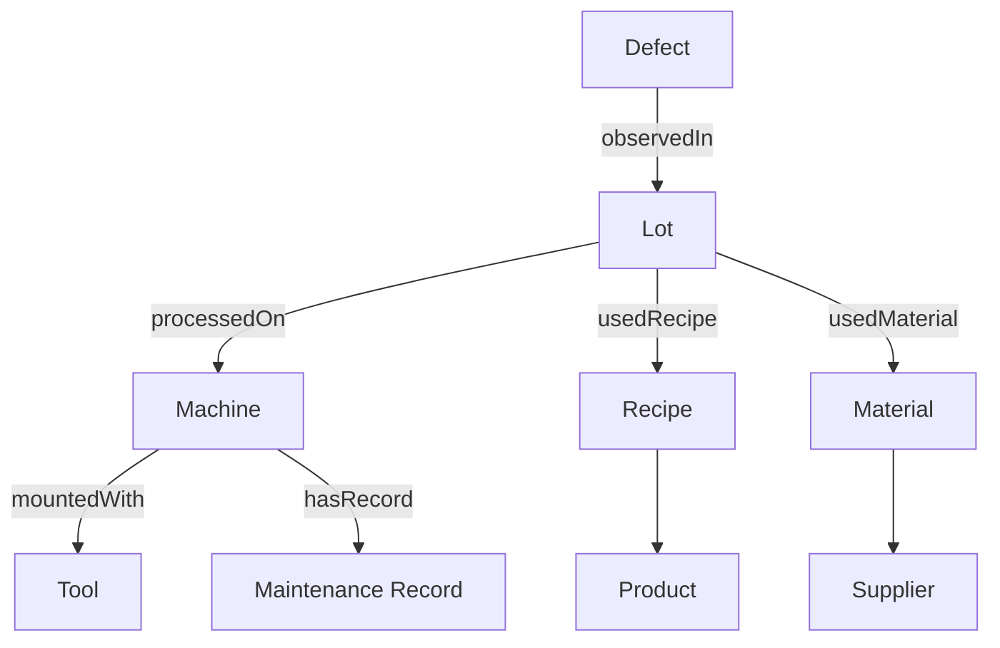
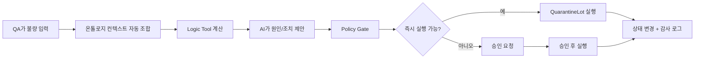
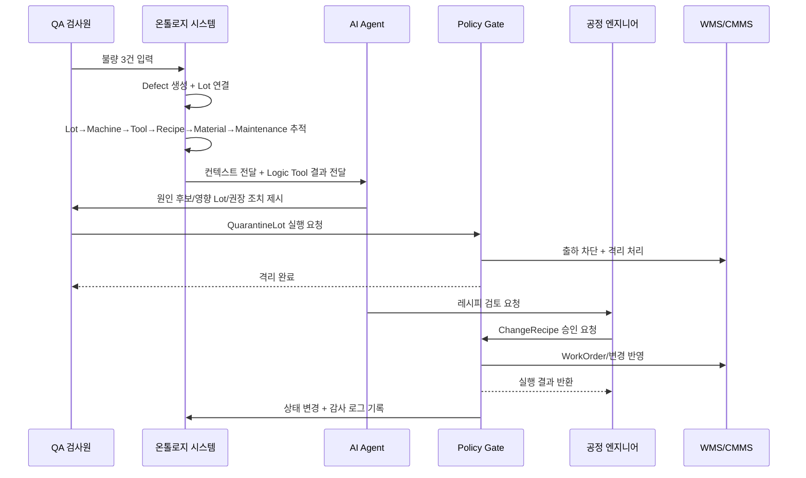

# 시나리오 A — 불량 Lot 즉시 판단 시스템

## “불량 하나를 입력하면, 원인·영향 범위·즉시 조치가 수분 내에 연결되는 방식”

### 1. 왜 이 시스템이 필요한가

제조 현장에서는 불량이 발견돼도, 그 즉시 원인을 알 수 없는 경우가 많다.
QA는 QMS를 보고, 공정팀은 MES와 PLM을 보고, 설비팀은 CMMS를 보고, 센서 데이터는 SCADA에서 따로 확인한다. 같은 설비도 시스템마다 이름이 다르고, Lot·Recipe·Tool·Maintenance가 한 번에 연결되지 않기 때문에, 원인 추적은 사람의 전화·엑셀·회의에 의존하게 된다. 이런 구조 때문에 불량 원인 분석은 보통 **6시간~3일**, 길게는 그동안 의심 Lot가 계속 추가 생산되는 문제가 생긴다.  

```mermaid
flowchart LR
    A[불량 발견] --> B[QMS 수기 입력]
    B --> C[QA가 MES 조회]
    C --> D[공정팀에 전화]
    D --> E[PLM에서 레시피 확인]
    E --> F[SCADA CSV 추출]
    F --> G[CMMS 정비 이력 확인]
    G --> H[엑셀 병합]
    H --> I[회의]
    I --> J[조치 결정]
    J --> K[수동 실행]

    style H fill:#ffe6e6,stroke:#cc0000
    style I fill:#ffe6e6,stroke:#cc0000
```

---

### 2. 기존 방식에서는 실제로 어떻게 흘러가는가

오전 9시 15분, 수원 1공장 SMT Line A의 CNC-14에서 생산된 Lot를 초물 검사하던 QA가 `Edge Burr` 불량 3건을 발견한다. 불량률은 30%다.
기존 방식에서는 이 시점에 QMS에 불량을 등록하고, 조장에게 알리고, 일단 생산을 계속 돌리는 경우가 많다. 이후 QA가 MES를 보고, 공정 엔지니어가 PLM에서 레시피 변경 이력을 보고, 또 SCADA에서 센서 로그를 보고, CMMS에서 정비 이력을 확인해가며 원인을 모은다. 문서에 정리된 시나리오 A에서는 실제로 이 분석과 승인에 약 **5시간**이 걸렸고, 그 사이 **의심 Lot 8개**가 추가로 생산됐다. 

---

### 3. 온톨로지가 들어가면 무엇이 달라지는가

온톨로지는 데이터를 한 군데 저장하는 기술이 아니라, 서로 다른 시스템의 데이터를 **같은 현실 세계 객체로 묶는 의미 계층**이다.
예를 들어 ERP의 `EQ-001-A`, MES의 `MACHINE_A_LINE1`, CMMS의 `ASSET-00142`가 사실은 같은 설비라면, 온톨로지에서는 그것을 하나의 `Machine M-14`로 정의한다. 그래서 불량이 하나 들어왔을 때, 그 불량과 연결된 Lot, 설비, 공구, 레시피, 자재, 정비 이력을 시스템이 자동으로 따라갈 수 있다. 핵심은 데이터 복사가 아니라 **현실 세계를 객체와 관계로 재구성하는 것**이다. 

---

### 4. 이 시스템은 실제로 이렇게 동작한다

오전 9시 15분, QA가 검사 화면에 불량 3건을 입력한다.
그러면 시스템은 단순히 “불량 등록”만 하지 않고, `Defect` 객체를 만들고 그 불량을 `Lot L-2026-0316-A`에 연결한다. 그 즉시 시스템은 관계 그래프를 따라 `Lot → Machine → Tool / Recipe / Material / MaintenanceRecord`를 자동 탐색한다. 이 과정은 사람이 엑셀을 병합하는 것이 아니라, 미리 정의된 관계 체인을 따라 시스템이 수 초 내에 전체 맥락을 붙이는 것이다.   

예를 들어 화면에는 곧바로 이런 정보가 뜬다.
“이 Lot는 CNC-14에서 생산됐고, 현재 레시피는 `R-42-v2.3`, 공구는 `T-33`, 공구 마모율은 78%, 최근 정비는 4일 전 베어링 교체, 자재는 `AL-7075-Lot-0892`.” 그리고 같은 레시피를 쓴 다른 Lot, 같은 설비를 사용한 다른 Lot, 같은 자재를 쓴 다른 Lot까지 함께 따라간다. 이때 문서 기준으로 추가 영향 범위는 **총 12개 Lot**까지 자동 탐색된다.  

---

### 5. AI는 여기서 무엇을 하는가

AI는 감으로 “아마 이거겠네요”라고 말하는 존재가 아니다.
이 구조에서는 먼저 Data Tool이 관계를 읽고, 그다음 Logic Tool이 계산을 수행한다. 즉, `traceDefectCause`, `analyzeDefectContribution`, `evaluateMachineHealth` 같은 도구가 먼저 돌고, 그 결과를 AI가 사람에게 설명 가능한 형태로 요약한다. 문서의 통합 전략도 이 흐름을 **Data Tool → Logic Tool → Action Tool → Policy Gate** 구조로 정의하고 있다. 

문서 시나리오 A에서는 그 결과가 이런 식으로 정리된다.
원인 기여도 1순위는 **레시피 변경(52%)**, 2순위는 **공구 마모(28%)**, 3순위는 **정비 후 런인 영향(12%)**이다. 즉, 시스템은 “불량이 났다”를 넘어서, “왜 이 조합이 가장 의심스러운가”를 계량적으로 정리해준다. 

---

### 6. 그런데 AI가 멋대로 레시피를 바꾸는 것은 아니다

여기서 중요한 포인트가 하나 있다.
이 시스템은 “AI가 자동으로 라인을 멈추고 레시피를 바꾸는 시스템”이 아니다. 문서의 핵심 원칙은 **LLM은 Action을 제안만 하고, 실행은 정책 게이트가 권한·유효성·승인 절차를 확인한 뒤 수행한다**는 것이다. 그래서 자연어와 운영 시스템 사이에 통제층이 생기고, 할루시네이션이 바로 실행으로 이어지지 않는다.  

---

### 7. 실제 조치는 어떻게 나뉘는가

이 사건에서 시스템은 4개의 조치를 제안한다.
첫째, 관련 Lot를 즉시 격리하자. 둘째, 공정 엔지니어에게 이 불량을 에스컬레이션하자. 셋째, 공구 교체 작업지시를 만들자. 넷째, 레시피는 검토 대상으로 올리자. 여기서 `QuarantineLot`은 QA가 바로 실행할 수 있지만, `ChangeRecipe`는 공정→품질→생산의 **3단계 승인**이 필요하다. 문서 시나리오 A도 이 구조로 작성돼 있다. 

즉, 오전 9시 17분에 QA가 `격리 실행`을 누르면, 관련 12개 Lot가 일괄 격리되고 WMS에 출하 차단 API가 자동 호출된다. 동시에 품질팀과 물류팀에 알림이 간다. 이후 공정 엔지니어는 레시피 원복을 검토하고, 공구 교체 작업지시는 자동으로 생성되어 정비팀으로 넘어간다. 이것이 “분석”이 아니라 “운영 실행”까지 닫힌 루프라는 뜻이다.   

---

### 8. 사람 입장에서는 무엇이 바뀌는가

QA는 더 이상 “불량 등록 담당자”가 아니다.
불량을 넣는 순간 시스템이 맥락을 자동으로 붙여주기 때문에, QA는 바로 격리 여부를 판단할 수 있다.

공정 엔지니어는 더 이상 여러 시스템을 오가며 데이터를 모으는 사람이 아니다.
이미 정리된 원인 후보와 근거 체인을 보고, 레시피 변경이 정말 필요한지 검토하는 역할로 올라간다.

조장과 생산관리자는 더 이상 전화와 카톡으로 상황을 수습하지 않는다.
같은 Incident를 기준으로, 같은 화면에서, 같은 사실을 본다.

정비팀은 “뭔가 이상하니 한번 봐달라”가 아니라, 어떤 공구를 왜 바꿔야 하는지 근거가 포함된 WorkOrder를 받는다.
즉, 온톨로지는 데이터를 연결하는 기술이면서 동시에 **부서 간 동일 현실(shared reality)** 을 만드는 시스템이다.  

---

### 9. 전체 흐름을 한 장으로 보면

---

### 10. 결국 이 시스템의 본질은 무엇인가

이 시스템의 본질은 “데이터를 예쁘게 연결한 그래프”가 아니다.
본질은 **불량 하나가 들어왔을 때, 그 불량과 연결된 설비·공구·레시피·정비 이력을 자동으로 엮고, 원인과 영향 범위를 수십 초 안에 정리해서, 격리·검사·정비·승인 요청까지 바로 이어주는 운영형 온톨로지**라는 점이다. 문서 로드맵도 이 시나리오의 성공 기준을 **원인 추적 6시간 → 15분 이하**, **영향 범위 자동 파악률 90% 이상**, **감사 로그 완전성 100%**로 잡고 있다. 

---

## 마지막 한 문장

**“온톨로지의 가치는 데이터를 연결하는 데 있지 않다. 불량이 발생했을 때, 무엇을 멈추고 누구를 움직여야 하는지를 5분 안에 알게 해주는 데 있다.”**  

